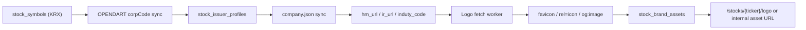

# KRX 로고 수집 Phase 1 설계

작성일: 2026-03-23  
대상: FOLO 백엔드 국내주식(`KRX`) 로고/섹터 데이터 수집 설계

## 배경

- 미국장은 이미 Polygon 기반 metadata enrichment가 들어가 있다.
- 국내장은 KIS 종목 마스터 정규화 CSV를 통해 `sectorName`, `industryName`
  을 일부 채우고 있지만, 회사 로고는 아직 안정적인 공급자가 없다.
- 장기적으로 비용과 통제를 우선하려면 `외부 로고 SaaS 의존`보다
  `공식 회사 메타 + 자체 수집 + 내부 캐시` 구조가 맞다.

## 목표

- 국내주식 로고를 `OPENDART + 자체 수집` 구조로 가져간다.
- 종목 단위 회사 메타를 공식 소스로 확보한다.
- 로고 수집 실패 시에도 앱이 깨지지 않도록 fallback을 유지한다.
- 국내 섹터 데이터는 `현재 KIS master 기반 표시값`을 유지하되,
  `OPENDART 산업코드`를 raw 기준축으로 추가한다.

## 비목표

- Phase 1에서 S3 + CloudFront까지 바로 구현하지 않는다.
- Phase 1에서 모든 KRX 종목의 고품질 SVG/투명 PNG를 보장하지 않는다.
- Phase 1에서 KRX Data Marketplace를 비공식 크롤링 API처럼 쓰지 않는다.

## 공식 소스

- OPENDART `corpCode.xml`
  - `stock_code -> corp_code` 매핑 제공
  - https://opendart.fss.or.kr/guide/detail.do?apiGrpCd=DS001&apiId=2019018
- OPENDART `company.json`
  - `corp_name`, `stock_code`, `corp_cls`, `hm_url`, `ir_url`, `induty_code`
    제공
  - https://opendart.fss.or.kr/guide/detail.do?apiGrpCd=DS001&apiId=2019002
- KIS 공식 GitHub `stocks_info`
  - 국내 종목 마스터와 업종 코드 참고 파일 제공
  - https://github.com/koreainvestment/open-trading-api/tree/main/stocks_info
- KRX Data Marketplace
  - `전종목 기본정보`, `업종분류 현황`, `상장회사 상세검색` 메뉴 존재
  - 런타임 API라기보다 공식 기준 데이터/검증 소스로 보는 것이 안전
  - https://data.krx.co.kr/contents/MDC/MAIN/main/index.cmd

## 핵심 판단

### 1. 로고 이미지는 OPENDART가 직접 주지 않는다

OPENDART는 회사 개황과 회사 URL은 주지만, 로고 파일 자체는 주지 않는다.
따라서 구조는 아래처럼 나뉜다.

- `OPENDART`: 회사 매핑과 공식 홈페이지/IR URL 공급
- `FOLO 수집기`: favicon, `rel=icon`, `og:image`, IR 페이지 CI 수집
- `FOLO 저장소`: 내부 경로 또는 이후 S3

### 2. 국내 섹터는 단일 소스로 끝내지 않는다

국내 섹터/업종은 아래처럼 역할을 분리하는 것이 맞다.

- `KIS domestic master thematic flag`
  - 앱 표시용 `sectorName`, `industryName`의 1차 소스
  - 현재 구현과 가장 자연스럽게 이어진다.
- `OPENDART induty_code`
  - 공식 raw 산업코드 축
  - 회사 단위 canonical metadata로 저장 가치가 높다.
- `KRX Data Marketplace`
  - 검증용 또는 백필용 공식 레퍼런스
  - 런타임 호출 소스보다는 운영 점검 소스로 둔다.

## 현재 구현과의 연결점

현재 국내 섹터는 이미 아래 경로가 존재한다.

- [KisDomesticMasterMetadataEnrichmentProvider.java](/Users/godten/.codex/worktrees/a784/folo-backend/src/main/java/com/folo/stock/KisDomesticMasterMetadataEnrichmentProvider.java)
- [kis-domestic-master-normalization.md](/Users/godten/.codex/worktrees/a784/folo-backend/docs/kis-domestic-master-normalization.md)

즉 Phase 1에서 섹터는 새로 갈아엎는 것이 아니라 아래처럼 확장한다.

- 유지:
  - `stock_symbols.sectorName`
  - `stock_symbol_enrichments`의 `KIS_MASTER` 기반 표시값
- 추가:
  - `OPENDART` 회사 메타
  - `induty_code`
  - `hm_url`, `ir_url`

## Phase 1 로고 설계

### 아키텍처

### 우선순위

1. `hm_url` favicon
2. `hm_url`의 HTML `rel=icon`
3. `hm_url`의 `og:image`
4. `ir_url`에서 동일 규칙 재시도
5. 실패 시 fallback

### 수집 대상

- Phase 1은 `KRX active STOCK`만 대상
- ETF/ETN/리츠/펀드성 상품은 제외
- 우선순위:
  - 포트폴리오 보유 종목
  - 검색/추천 상위 종목
  - 시가총액 상위 종목
  - 나머지 active 종목

### Phase 1 저장 모델 제안

#### `stock_issuer_profiles`

- `stock_symbol_id`
- `corp_code`
- `corp_cls`
- `corp_name`
- `stock_code`
- `hm_url`
- `ir_url`
- `induty_code`
- `last_synced_at`
- `source_payload_version`

의도:
- 회사 메타는 `enrichment`와 별도 lifecycle을 갖게 한다.
- 로고 수집과 섹터 raw code가 이 테이블을 같이 쓴다.

#### `stock_brand_assets`

- `stock_symbol_id`
- `provider`
  - 예: `OPENDART_SITE`
- `source_type`
  - `FAVICON`
  - `HTML_ICON`
  - `OG_IMAGE`
  - `MANUAL`
- `source_url`
- `content_type`
- `status`
  - `READY`
  - `FAILED`
  - `BLOCKED`
- `storage_key`
  - Phase 1에서는 local path 또는 내부 asset key
  - 이후 S3 key로 이행
- `width`
- `height`
- `etag`
- `last_fetched_at`
- `last_checked_at`

### API 영향

Phase 1에서는 현재 구조를 크게 바꾸지 않는다.

- `/stocks/search`
- `/stocks/discover`
- `/stocks/{ticker}/price`

위 응답의 `logoUrl`은 유지한다. 단, 내부 구현은 아래 순서로 바뀐다.

1. `stock_brand_assets`에 `READY` 자산이 있으면 내부 URL 반환
2. 없으면 기존 `StockBrandingService` fallback 사용
3. 그것도 실패하면 initials/market badge fallback

즉 프론트 계약은 유지하고, 백엔드 로고 소스만 교체/확장한다.

## Phase 1 섹터 데이터 전략

### 추천 방향

국내 섹터는 아래 3층 구조로 가는 것이 맞다.

#### Layer 1. 표시용 섹터

현재처럼 `KIS domestic master thematic flag`를 사용한다.

이유:
- 이미 구현돼 있다.
- 앱의 `sectorName`, `industryName` 표시용으로 충분히 읽기 좋다.
- KRX/KOSDAQ를 하나의 `KRX` universe로 다루는 현재 모델과 잘 맞는다.

용도:
- `stock_symbols.sectorName`
- 추천/필터/포트폴리오 분석의 사용자 노출 섹터

#### Layer 2. 공식 raw 산업 코드

`OPENDART company.json`의 `induty_code`를 저장한다.

이유:
- 회사 단위 공식 식별자다.
- 향후 섹터 매핑 규칙을 바꾸더라도 raw 값은 유지할 수 있다.
- 로고 수집에 필요한 `corp_code`, `hm_url`, `ir_url`와 같이 가져올 수 있다.

용도:
- `stock_issuer_profiles.induty_code`
- 향후 KSIC 매핑
- 섹터 분류 규칙 재처리

#### Layer 3. 검증/백필

`KRX Data Marketplace`의 아래 메뉴를 운영 검증용 소스로 둔다.

- `전종목 기본정보`
- `업종분류 현황`
- `상장회사 상세검색`

이유:
- 공식성이 높다.
- 다만 현재 FOLO는 안정적 공개 API contract 없이 이걸 런타임 호출 소스로
  삼기 어렵다.

용도:
- 월 1회 수동 export 또는 배치 파일 ingest
- KIS thematic 분류와 OPENDART 기반 분류의 mismatch 점검

### Phase 1 구현 원칙

1. `sectorName`은 계속 KIS master 우선
2. `induty_code`는 새 raw 필드로 추가
3. `induty_code -> display sector` 매핑은 Phase 1에서 필수가 아님
4. 다만 상위 종목군은 수동 검증 매핑 테이블을 추가할 수 있음

### 향후 확장

`StockClassificationScheme`는 현재 `SIC`, `KIS_MASTER`만 있다.
국내 확장을 위해 아래 추가를 고려한다.

- `OPENDART_KSIC`
- `KRX_SECTOR`

Phase 1에서는 enum 추가 없이 `stock_issuer_profiles`에 raw code만 넣고,
Phase 2에서 sector derivation scheme까지 늘리는 편이 안전하다.

## 구현 단계

### Step 1. OPENDART 회사 메타 수집

- `corpCode.xml` sync
- `company.json` sync
- `stock_issuer_profiles` upsert

완료 기준:
- `005930`, `000660`, `035420` 등 주요 종목에
  `corp_code`, `hm_url`, `ir_url`, `induty_code` 저장

### Step 2. 로고 수집기

- URL normalize
- favicon fetch
- `rel=icon`, `og:image` fallback
- 이미지 content-type 검사
- 너무 큰 이미지/HTML 응답 방어

완료 기준:
- 상위 KRX 종목 일부에서 내부 로고 URL 생성
- 실패 종목은 fallback 동작

### Step 3. 내부 서빙 연결

- `StockBrandingService`에 `KRX internal asset first` 규칙 추가
- 기존 Twelve Data/Polygon fallback은 미국장 중심으로 유지

완료 기준:
- 국내 주요 종목은 외부 로고 provider 없이도 내부 자산 우선 노출

### Step 4. 섹터 raw 축 추가

- `stock_issuer_profiles.induty_code` 저장
- 운영 문서에 KIS vs DART vs KRX source hierarchy 정리

완료 기준:
- 국내 주요 종목에 raw industry code 확보

## 실패 처리와 fallback

### 로고 실패 시

- 네트워크 실패: `FAILED`, 재시도 가능
- 홈페이지 없음: `FAILED`
- 이미지가 아닌 응답: `BLOCKED`
- robots/TOS 이슈가 있는 경우: `BLOCKED`

앱 fallback:
- 시장 배지
- 종목명 첫 글자
- 향후 섹터별 기본 아이콘

### 섹터 데이터 실패 시

- `sectorName` 없으면 기존 값 유지
- `induty_code` 없으면 null 허용
- KIS master 값과 DART code가 불일치해도 Phase 1에서는 표시용 KIS 우선

## 운영 메모

- OPENDART는 요청 제한이 있으므로 `company.json`은 초기 풀스캔 후 증분 갱신이 맞다.
- 로고 fetch는 배치/비동기 처리로 두고, 앱 요청 시 실시간 수집은 피한다.
- 회사 홈페이지 로고는 자주 바뀌지 않으므로 `last_checked_at` 기준 주간 재검사면 충분하다.
- 상표/브랜드 사용 정책 검토가 필요하므로 `manual override` 경로를 남긴다.

## 결론

- 로고:
  - `OPENDART로 회사 URL 확보 -> 자체 수집 -> 내부 캐시`가 장기적으로 가장 맞다.
- 국내 섹터:
  - `표시값은 KIS master`
  - `raw 기준축은 OPENDART induty_code`
  - `검증/백필은 KRX Data Marketplace`

즉 Phase 1의 정답은 `국내 로고와 섹터를 한 소스로 해결하려 하지 말고`,
`회사 메타`, `표시용 섹터`, `검증용 기준 데이터`를 분리하는 것이다.
